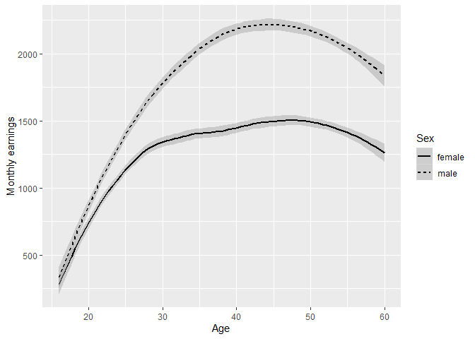
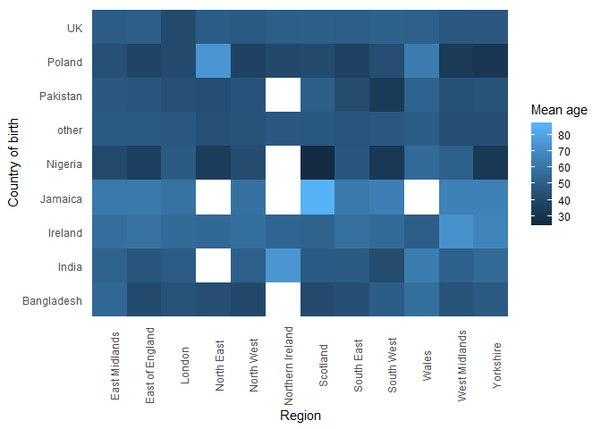
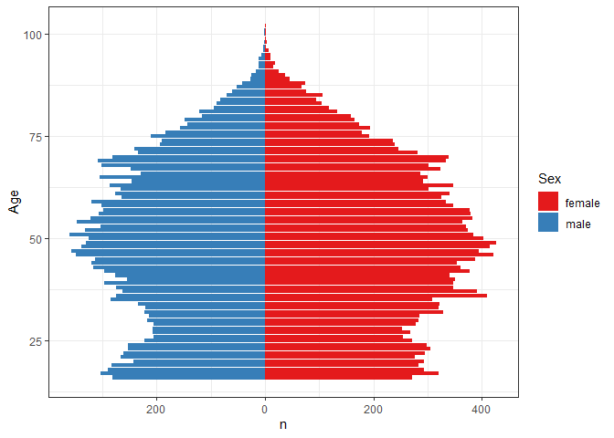

Statistical assignment 4
================
Eliot Barrett - Holman 087675
27/02/2020

In this assignment you will need to reproduce 5 ggplot graphs. I supply
graphs as images; you need to write the ggplot2 code to reproduce them
and knit and submit a Markdown document with the reproduced graphs (as
well as your .Rmd file).

First we will need to open and recode the data. I supply the code for
this; you only need to change the file paths.

    ```r
    library(tidyverse)
    Data8 <- read_tsv("C:/Users/eliot/Documents/Politics and IR/Year 2 Term 2/Data 3/Data3_blank/data/UKDA-6614-tab/tab/ukhls_w8/h_indresp.tab")
    Data8 <- Data8 %>%
        select(pidp, h_age_dv, h_payn_dv, h_gor_dv)
    Stable <- read_tsv("C:/Users/eliot/Documents/Politics and IR/Year 2 Term 2/Data 3/Data3_blank/data/UKDA-6614-tab/tab/ukhls_wx/xwavedat.tab")
    Stable <- Stable %>%
        select(pidp, sex_dv, ukborn, plbornc)
    Data <- Data8 %>% left_join(Stable, "pidp")
    rm(Data8, Stable)
    Data <- Data %>%
        mutate(sex_dv = ifelse(sex_dv == 1, "male",
                           ifelse(sex_dv == 2, "female", NA))) %>%
        mutate(h_payn_dv = ifelse(h_payn_dv < 0, NA, h_payn_dv)) %>%
        mutate(h_gor_dv = recode(h_gor_dv,
                         `-9` = NA_character_,
                         `1` = "North East",
                         `2` = "North West",
                         `3` = "Yorkshire",
                         `4` = "East Midlands",
                         `5` = "West Midlands",
                         `6` = "East of England",
                         `7` = "London",
                         `8` = "South East",
                         `9` = "South West",
                         `10` = "Wales",
                         `11` = "Scotland",
                         `12` = "Northern Ireland")) %>%
        mutate(placeBorn = case_when(
                ukborn  == -9 ~ NA_character_,
                ukborn < 5 ~ "UK",
                plbornc == 5 ~ "Ireland",
                plbornc == 18 ~ "India",
                plbornc == 19 ~ "Pakistan",
                plbornc == 20 ~ "Bangladesh",
                plbornc == 10 ~ "Poland",
                plbornc == 27 ~ "Jamaica",
                plbornc == 24 ~ "Nigeria",
                TRUE ~ "other")
        )
    ```

Reproduce the following graphs as close as you can. For each graph,
write two sentences (not more\!) describing its main message.  
\# remember 2 sentences per graph describing its main message

1.  Univariate distribution (20 points). \# think this is just a one
    variable thing and you rename label for count
    
    ``` r
    head(Data)
    ```
    
        ## # A tibble: 6 x 8
        ##     pidp h_age_dv h_payn_dv h_gor_dv      sex_dv ukborn plbornc placeBorn
        ##    <dbl>    <dbl>     <dbl> <chr>         <chr>   <dbl>   <dbl> <chr>    
        ## 1  22445       31      2000 London        female      1      -9 UK       
        ## 2  29925       39      1200 London        female      1      -9 UK       
        ## 3  76165       33      2200 West Midlands female      1      -9 UK       
        ## 4 223725       41        NA South East    male        1      -9 UK       
        ## 5 280165       37      2263 South East    female      1      -9 UK       
        ## 6 333205       26      1550 West Midlands female      1      -9 UK
    
    ``` r
    ggplot(data = Data, aes(x = h_payn_dv)) + 
      geom_freqpoly() +
      labs( y = "Number of respondents", x = "Net monthly pay")
    ```
    
    <!-- -->
    
    ``` r
    # this graph shows that net monthly pay is largely concentrated around  approximately 1400, with the largest number of respondents.
    # Understandably, after this pont increasing pay is associated with a smaller number of respondents, exccept a small spike around the 4500 a month mark which itself quickly falls off
    ```

2.  Line chart (20 points). The lines show the non-parametric
    association between age and monthly earnings for men and women.
    
    ``` r
    bysex <- Data %>% 
                  group_by(sex_dv, h_age_dv) %>%
                  summarise( mean_income = mean(h_payn_dv, na.rm = TRUE)) 
    
    bysex %>% ggplot(aes(x = h_age_dv, y = mean_income, colour =sex_dv))+
          geom_smooth(aes(linetype = sex_dv), color = "black")+
          xlim( 16,60)+
          labs( x = "Age", y = "Monthly earnings", linetype = "Sex") 
    ```
    
    <!-- -->
    
    ``` r
    #this graph shows that the mean monthly income of a male is higher than that of a female at all ages
    # this difference becomes more apparent after age 20 and is seen at its largest differnce around age 35, it seems that after age 50 the difference between the sexes is slightly decreasing
    ```

3.  Faceted bar chart - country of birth (20 points).
    
    ``` r
        Bysexandplace <- Data %>%
        filter(!is.na(sex_dv)) %>% filter(!is.na(placeBorn)) %>%
        group_by(sex_dv, placeBorn) %>% 
        summarise(medianIncome = median(h_payn_dv, na.rm = TRUE)) 
    
    Bysexandplace %>% ggplot(aes(x = sex_dv, y = medianIncome)) + 
      geom_bar(stat = "identity") +
      facet_wrap(~ placeBorn, ncol = 3) + 
      labs( y = "Median monthly net pay", x = "Sex")
    ```
    
    <!-- -->
    
    ``` r
    #This faceted barchart shows that men make a higher median net pay than their female counterparts for each place of birth.
    # Moreover, we see the largest gap in median incomes between men and women of those born in Ireland, with the smallest gap being those born in Bangladesh.
    ```

4.  Heat map (20 points). \# mean age by country of birth and region
    
    ``` r
    # chapter 7 from r for data science
    
     ByBirthandRegion <- Data %>%
        filter(!is.na(placeBorn)) %>% filter(!is.na(h_gor_dv)) %>%
        group_by(h_gor_dv, placeBorn) %>% 
        summarise(Mean_age = mean(h_age_dv, na.rm = TRUE)) 
    
    
    ByBirthandRegion %>% 
      ggplot(aes(x = h_gor_dv, y = placeBorn)) +
      geom_tile(aes(fill = Mean_age)) +
      theme_classic() +
      theme(axis.text.x = element_text(angle = 90), line = element_blank() ) +
      labs(x = "Region", y = "Country of birth", fill = "Mean age") 
    ```
    
    <!-- -->
    
    ``` r
      # this heat map shows relative uniformity between the mean age of respondents across different regions of the UK, given different countries of birth
      # it looks as if respondents born in Nigeria or Poland are the youngest on average, with those born in Jamaica being the oldest on average
    ```

5.  Population pyramid (20 points).
    
    ``` r
     Data %>% filter(!is.na(h_age_dv)) %>% filter(!is.na(sex_dv)) %>%   
      ggplot(aes(x= h_age_dv,fill= sex_dv)) + 
      geom_bar(data=subset(Data,sex_dv=="female")) + 
      geom_bar(data=subset(Data,sex_dv=="male"),aes(y=..count..*(-1)))+
      scale_y_continuous(breaks = seq(-400, 400, 200), 
                     labels = paste0(as.character(c(seq(400, 0, -200), seq(200, 400, 200))))) +  # removed the -200 from the example
      coord_flip() +
      scale_fill_brewer(palette = "Set1") + 
      theme_bw() + 
      labs(y = "n" , x ="Age", fill = "Sex")
    ```
    
    <!-- -->
    
    ``` r
       # this population pyramid shows that generally the number of males and females for any given age is similar
       # despite dips in number of respondents for both sexes in their twenties these pick up until we see the highest number of respondents at around 51 for males and 49 for females
    ```
